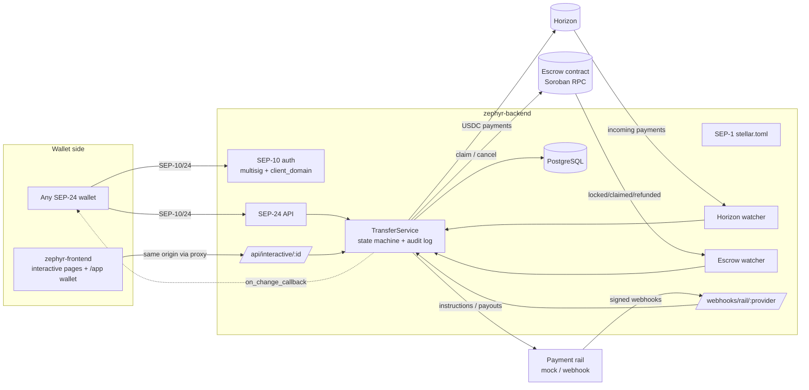

# Zephyr Backend

[](https://github.com/zephyr-ramp/zephyr-backend/actions/workflows/ci.yml)
[](LICENSE)


**Zephyr** (a gentle west wind: fast, light money movement) is an open-source **USD ⇄ USDC on/off-ramp** for the [Stellar](https://stellar.org) network. This repository is the **anchor server**.

- **Deposit (on-ramp):** send US dollars by bank transfer, receive USDC in your Stellar wallet.
- **Withdraw (off-ramp):** send USDC, receive US dollars in your bank account, either with a plain Stellar payment (any SEP-24 wallet) or through the [Soroban escrow](https://github.com/zephyr-ramp/zephyr-contracts), which refunds you if we never pay out.

> [!WARNING]
> **Not production-ready.** Zephyr runs on **testnet** by default, uses a mock bank, and has not been audited. Don't use it with real money. Mainnet requires explicit configuration (`STELLAR_NETWORK=public`, plus a database) and an audit first.

## Zephyr repositories

| Repo                                                                | What it is                                                           | How it connects here                                                                                                              |
| ------------------------------------------------------------------- | -------------------------------------------------------------------- | --------------------------------------------------------------------------------------------------------------------------------- |
| **zephyr-backend** (you are here)                                   | Anchor server: SEP-1/10/24, state machine, rails, watchers, Postgres | —                                                                                                                                 |
| [zephyr-frontend](https://github.com/zephyr-ramp/zephyr-frontend)   | SEP-24 interactive pages + reference wallet                          | Proxied at `/sep24/interactive/*`; calls `/api/interactive/:id`; generates its API types from [`openapi.yaml`](openapi.yaml)      |
| [zephyr-contracts](https://github.com/zephyr-ramp/zephyr-contracts) | Soroban withdrawal escrow                                            | We watch its events and call `claim` / `cancel` through its generated client `@zephyr-ramp/escrow-client` (vendored in `vendor/`) |

## Architecture



### Transaction lifecycles

All status names are exactly SEP-24's. Every transition is checked against [`src/sep24/state.ts`](src/sep24/state.ts) and written to the `audit_log` table with who or what caused it.

```
Deposit           incomplete → pending_user_transfer_start → pending_anchor → pending_stellar → completed
Standard withdraw incomplete → pending_user_transfer_start → pending_anchor → pending_external → completed
Escrow withdraw   incomplete → pending_user_transfer_start → pending_anchor → pending_external
                    → pending_stellar (claiming) → completed
                    → refunded (payout failed → anchor cancels, or user refunds after expiry)
Anything unexpected → error (manual review; never paid automatically)
```

## Quick start (testnet)

Requirements: Node.js 20+.

```bash
npm install
cp .env.example .env
npm run keys:generate   # prints keys to paste into .env; funds the distribution account via Friendbot
npm run dev
curl localhost:8080/.well-known/stellar.toml
```

That runs with the in-memory store, the mock bank and the **sandbox escrow** (a simulated contract), so every flow works offline except the on-chain USDC payments.

**With Postgres and the frontend:** check out `zephyr-frontend` next to this repo and run `docker compose up --build`. This starts Postgres, the backend (migrations run on start) and the frontend. See [docker-compose.yml](docker-compose.yml).

**With the real escrow contract:** set `ESCROW_CONTRACT_ID=CCQCVQTYB45FXJG6BPLR4RPBMBOE4VD73MUMTDWT6Q55TXINSEBV3IOQ` (testnet) and `ESCROW_ANCHOR_SECRET` to the secret of the contract's `anchor` address. Or deploy your own with `zephyr-contracts/scripts/deploy-testnet.sh` using `ANCHOR_ADDRESS=<your distribution account>`.

## Try it on testnet (sandbox)

The sandbox endpoints (`ENABLE_SANDBOX=true`, refused on mainnet) play the bank and, without `ESCROW_CONTRACT_ID`, the chain.

**Deposit:** open the reference wallet (`http://localhost:3000/app` from zephyr-frontend), connect Freighter, and choose **Deposit**. Fill in the form, then play the bank:

```bash
curl -X POST localhost:8080/sandbox/deposits/<id>/fiat-received
# → pending_anchor → pending_stellar → completed; USDC lands in your wallet
```

**Escrow withdrawal:** in the wallet choose **Withdraw → Escrow**. The wallet signs the escrow `deposit` and locks your USDC. The escrow watcher sees `locked`, the mock bank pays out, the backend calls `claim`, and the status becomes `completed`. With the sandbox escrow you can simulate the lock and the failure paths:

```bash
curl -X POST localhost:8080/sandbox/withdrawals/<id>/escrow-lock        # wallet locks funds
curl -X POST localhost:8080/sandbox/withdrawals/<id>/escrow-refund \
     -H 'content-type: application/json' -d '{"advance_ledgers": 20000}'  # user refunds after expiry
curl localhost:8080/sandbox/transactions/<id>/audit                     # every transition, who and when
```

To fund the distribution account with testnet USDC: add a trustline to `USDC:GBBD47IF6LWK7P7MDEVSCWR7DPUWV3NY3DTQEVFL4NAT4AQH3ZLLFLA5` in [Stellar Lab](https://lab.stellar.org) and use [Circle's faucet](https://faucet.circle.com).

## Endpoints

| Endpoint                                                                                                  | Spec                                                                                                                                      |
| --------------------------------------------------------------------------------------------------------- | ----------------------------------------------------------------------------------------------------------------------------------------- |
| `GET /.well-known/stellar.toml`                                                                           | SEP-1                                                                                                                                     |
| `GET/POST /auth`                                                                                          | SEP-10. Multisig via `verifyChallengeTxThreshold` with signers from Horizon; master key for unfunded accounts; `client_domain`            |
| `GET /sep24/info`, `POST /sep24/transactions/{deposit,withdraw}/interactive`, `GET /sep24/transaction(s)` | SEP-24, with `more_info_url`, `on_change_callback`, `refunded`/`refunds`, JSON / form / `multipart/form-data` bodies, `lang`, `paging_id` |
| `GET /sep24/transaction/more_info`                                                                        | `more_info_url` status page                                                                                                               |
| `GET/POST /api/interactive/:id`                                                                           | JSON API for the frontend's interactive pages ([openapi.yaml](openapi.yaml))                                                              |
| `POST /webhooks/rail/:provider`                                                                           | Signed, idempotent rail events ([docs/payment-rails.md](docs/payment-rails.md))                                                           |
| `GET /health`, `GET /ready`                                                                               | Liveness / readiness                                                                                                                      |
| `/sandbox/*`                                                                                              | Testnet simulation (see above)                                                                                                            |

`/auth`, SEP-24 `POST`s and `/api/interactive` are rate limited (`RATE_LIMIT_MAX` per `RATE_LIMIT_WINDOW_MS` per IP).

## Configuration

All config comes from environment variables, validated with zod at startup ([`src/config.ts`](src/config.ts)). The server refuses to start on invalid config. See [.env.example](.env.example).

| Variable                                             | Default                   | Description                                                                             |
| ---------------------------------------------------- | ------------------------- | --------------------------------------------------------------------------------------- |
| `BASE_URL`                                           | _(required)_              | Public URL of the anchor                                                                |
| `HOME_DOMAIN`                                        | host of `BASE_URL`        | SEP-10 home domain                                                                      |
| `SEP10_SIGNING_SECRET`                               | _(required)_              | Signs SEP-10 challenges and wallet callbacks. **Must differ** from the distribution key |
| `DISTRIBUTION_SECRET`                                | _(required)_              | Holds USDC: pays deposits, receives withdrawals                                         |
| `JWT_SECRET`                                         | _(required)_              | ≥ 32 characters                                                                         |
| `STELLAR_NETWORK`                                    | `testnet`                 | `testnet` or `public`                                                                   |
| `HORIZON_URL`                                        | testnet Horizon           |                                                                                         |
| `SOROBAN_RPC_URL`                                    | testnet RPC               |                                                                                         |
| `DATABASE_URL`                                       | _(none: in-memory)_       | PostgreSQL URL. **Required** on `public`                                                |
| `FRONTEND_URL`                                       | _(none)_                  | zephyr-frontend origin; enables the `/sep24/interactive/*` proxy                        |
| `USDC_ISSUER`                                        | Circle testnet issuer     |                                                                                         |
| `DEPOSIT_MIN/MAX`, `WITHDRAW_MIN/MAX`                | `1` / `10000`             | Decimal strings                                                                         |
| `FEE_FIXED`, `FEE_PERCENT`                           | `0.50`, `1`               | fee = fixed + amount × percent / 100, rounded to cents                                  |
| `PAYMENT_RAIL`                                       | `mock`                    | `mock` or `webhook`                                                                     |
| `RAIL_API_URL`, `RAIL_API_KEY`                       |                           | Required for `webhook`                                                                  |
| `RAIL_WEBHOOK_SECRET`                                | _(none: webhooks off)_    | HMAC secret, ≥ 16 characters                                                            |
| `ESCROW_CONTRACT_ID`                                 | _(none)_                  | Enables escrow withdrawals on chain                                                     |
| `ESCROW_ANCHOR_SECRET`                               | `DISTRIBUTION_SECRET`     | The escrow's `anchor` key (signs `claim`/`cancel`)                                      |
| `ESCROW_TIMEOUT_LEDGERS`                             | `17280` (~1 day)          | Timeout the wallet uses when locking                                                    |
| `ESCROW_MIN_REMAINING_LEDGERS`                       | `120` (~10 min)           | Don't pay out if the escrow expires sooner; cancel instead                              |
| `ESCROW_POLL_INTERVAL_MS`                            | `5000`                    | Escrow event polling                                                                    |
| `ESCROW_START_LEDGER`                                | ~1 day back               | First ledger to read when no cursor is saved                                            |
| `RATE_LIMIT_MAX`, `RATE_LIMIT_WINDOW_MS`             | `60`, `60000`             |                                                                                         |
| `ENABLE_SANDBOX`                                     | `false`                   | `/sandbox/*`; refused on `public`                                                       |
| `ENABLE_WITHDRAWAL_WATCHER`, `ENABLE_ESCROW_WATCHER` | `true`                    |                                                                                         |
| `PORT`, `HOST`, `LOG_LEVEL`                          | `8080`, `0.0.0.0`, `info` | Logs are structured JSON (pino); tokens and signatures are redacted                     |

## Project layout

```
src/
  app.ts            Wiring: store, rail, gateways, plugins, routes
  server.ts         Entry point: starts the Horizon and escrow watchers
  config.ts         Env validation (zod)
  sep1/ sep10/      stellar.toml; web auth (multisig, client_domain)
  sep24/
    service.ts      TransferService: all business logic (start here)
    state.ts        Allowed status transitions
    routes.ts       SEP-24 HTTP endpoints + server-rendered fallback pages
    serialize.ts    Store → SEP-24 JSON (more_info_url, refunds, escrow)
  api/              JSON API for zephyr-frontend
  escrow/           EscrowGateway: Soroban RPC impl, sandbox impl, event watcher
  rails/            PaymentRail: mock + webhook skeleton
  webhooks/         Signed, idempotent rail webhooks
  notify/           Signed on_change_callback delivery
  stellar/          Horizon gateway (payments, signers, stellar.toml lookup)
  store/            TransactionStore: Postgres (Drizzle) + in-memory; schema
  lib/              BigInt amounts, JWT, HMAC signatures, errors
drizzle/            Committed SQL migrations
openapi.yaml        OpenAPI 3.1 for non-SEP endpoints
test/               Vitest suites, all offline
```

## Development

```bash
npm test                # all tests, offline
npm run test:coverage   # with coverage (thresholds: 80% lines)
npm run lint && npm run format:check && npm run typecheck
npm run db:generate     # after editing src/store/schema.ts; commit drizzle/
npm run bindings:update # re-vendor @zephyr-ramp/escrow-client from ../zephyr-contracts
```

The Postgres store is tested against **PGlite** (real Postgres in WASM) on every run, and against a real Postgres container via testcontainers when Docker is available (skipped otherwise).

## Security

- The SEP-10 signing key, the distribution key and the escrow anchor key are checked to be different where it matters.
- Amounts are BigInt fixed-point or decimal strings everywhere ([`src/lib/amount.ts`](src/lib/amount.ts)); ESLint bans `parseFloat`.
- Any amount mismatch or unexpected state moves the transaction to `error` for manual review. It is never paid automatically.
- Escrow payouts only start if the escrow has at least `ESCROW_MIN_REMAINING_LEDGERS` left; otherwise the anchor cancels (refunds).
- Wallet callbacks must be HTTPS and are signed with SIGNING_KEY. Rail webhooks are HMAC-verified with replay protection.
- User input is HTML-escaped in server-rendered pages.

Report vulnerabilities privately: see [SECURITY.md](SECURITY.md).

## Roadmap

- [x] Postgres store with migrations, cursors and an audit log
- [x] SEP-10 multisig and `client_domain`
- [x] SEP-24 `more_info_url`, callbacks, refunds, multipart, `lang`
- [x] Escrow withdrawal mode (watch → payout → claim / cancel)
- [x] Webhook-driven rail skeleton
- [x] OpenAPI spec, health/readiness, rate limiting, Docker
- [ ] SEP-12 KYC API and KYC gating
- [ ] SEP-38 quotes
- [ ] A real bank / BaaS rail adapter
- [ ] Admin API and UI for `error` transactions (manual review)
- [ ] Transaction expiry job (`incomplete` → `expired`)
- [ ] Prometheus metrics
- [ ] External security audit

## Contributing

See [CONTRIBUTING.md](CONTRIBUTING.md). Pick an issue labelled `good first issue` or `help wanted` and **wait to be assigned**. Zephyr is part of the [Drips Wave](https://www.drips.network/wave) program (Trivial 100 / Medium 150 / High 200 points).

## License

[Apache-2.0](LICENSE)
